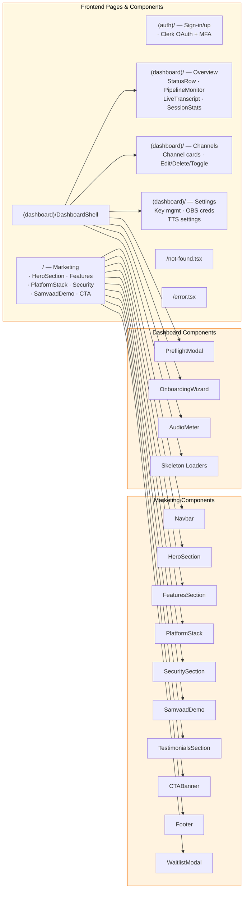
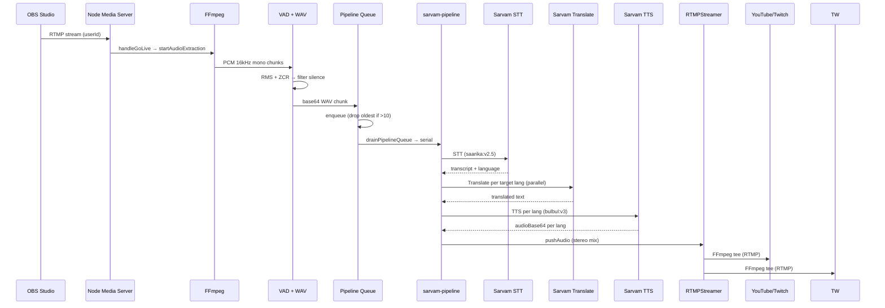
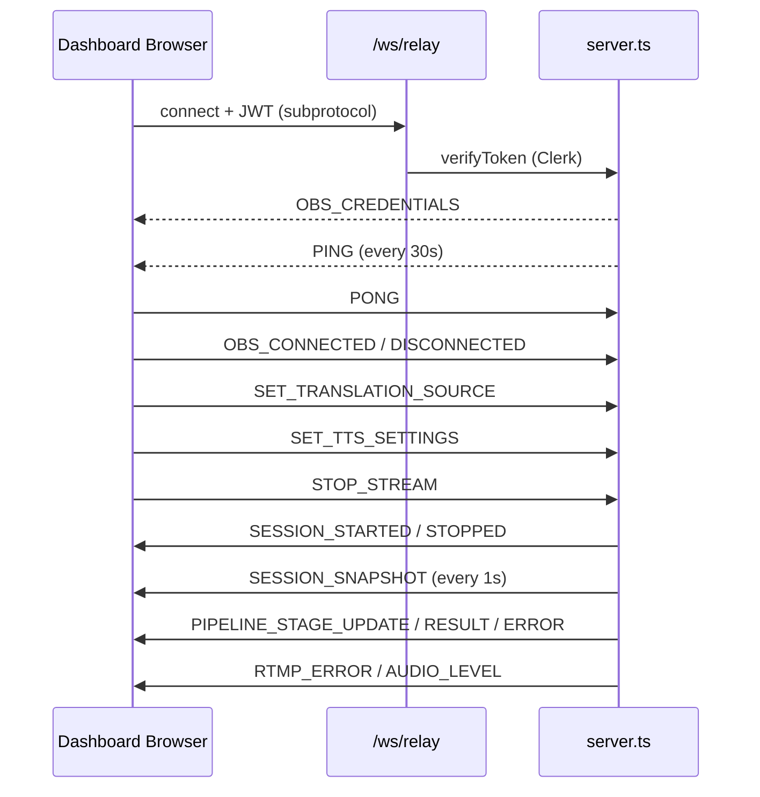
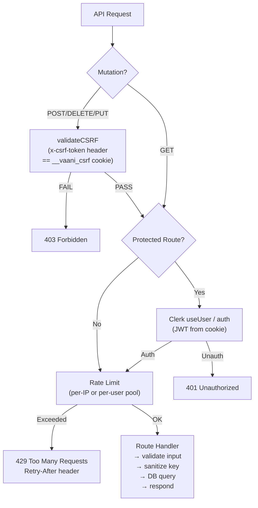
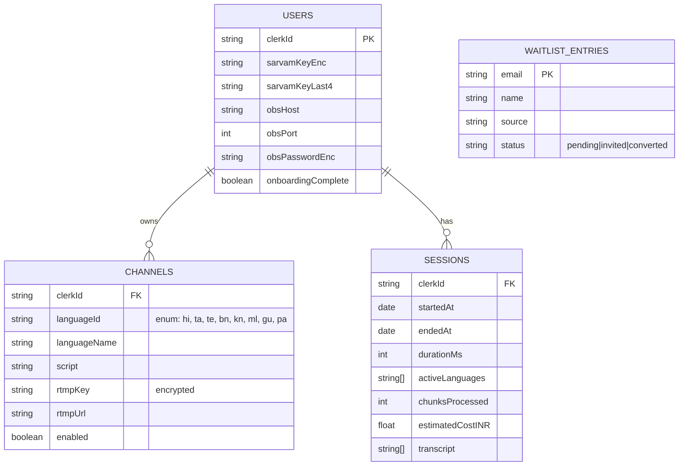

# Vaani — System Architecture

```mermaid
graph TB
    subgraph Client["🌐 Browser (Next.js Client)"]
        LP["Landing Page\n/"]
        AUTH["Auth Pages\n/sign-in /sign-up /sso-callback"]
        DASH["Dashboard\n/dashboard"]
        CHAN["Channels\n/channels"]
        SET["Settings\n/settings"]

        DASH_SHELL["DashboardShell\n(obs-relay-client, PreflightModal,\nOnboardingWizard)"]
        OBS_UI["OBS WebSocket\n(obs-websocket-js)"]
    end

    subgraph Server["⚙️ Node.js Server (server.ts)"]
        NEXT["Next.js HTTP Handler"]
        WS["WebSocket Server\n/ws/relay"]
        NMS["Node Media Server\nRTMP :1935"]
        RTMP_STREAMER["RTMPStreamer\n(FFmpeg tee → YouTube/Twitch)"]
        AUDIO_EXTRACT["Audio Extraction\n(FFmpeg → PCM → VAD → WAV)"]
        PIPELINE_QUEUE["Pipeline Queue\n(per-user serial, max 10)"]
    end

    subgraph APIS["API Routes"]
        API_CHAN["/api/channels\nGET · POST · DELETE"]
        API_KEY["/api/key\nDELETE · POST(validate/update)"]
        API_KEY_STATUS["/api/key/status · /api/key/status"]
        API_OBS["/api/obs/credentials\nPOST · DELETE"]
        API_OBS_ST["/api/obs/status"]
        API_SESS["/api/sessions\nGET · export"]
        API_CSRF["/api/csrf"]
        API_TEST["/api/test-pipeline"]
        API_HEALTH["/api/health"]
    end

    subgraph Lib["📦 Core Libraries"]
        SARBAM["sarvam-pipeline\nSTT → Translate → TTS"]
        LANG["language-registry\n8 languages"]
        ENC["encryption\nAES-256-GCM"]
        CSRF["csrf\ndouble-submit"]
        RL["rate-limit"]
        MONGO["mongodb\n(mongoose connect)"]
        SESSION["stream-session\n(per-user state)"]
        RELAY["obs-relay-client\n(browser-side WS)"]
    end

    subgraph Ext["🔌 External Services"]
        CLERK["Clerk Auth"]
        SARVAM_API["Sarvam AI API\nSTT · Translate · TTS"]
        YT["YouTube RTMP"]
        TW["Twitch RTMP"]
        OBS["OBS Studio"]
    end

    subgraph DB["🗄️ MongoDB"]
        USERS["users\n clerkId, sarvamKeyEnc,\nobsPasswordEnc"]
        CHANNELS["channels\n clerkId, languageId,\nrtmpKey(encrypted)"]
        SESSIONS["sessions\nstats · transcript · cost"]
        WAITLIST["waitlist_entries"]
    end

    OBS -->|"RTMP stream"| NMS
    DASH_SHELL -->|"initRelay (JWT)"| WS
    WS -->|"audio levels · session · pipeline"| DASH_SHELL
    SET -->|"CRUD"| API_KEY
    SET -->|"CRUD"| API_OBS
    CHAN -->|"CRUD"| API_CHAN
    DASH -->|"GET"| API_OBS_ST
    DASH -->|"GET"| API_KEY_STATUS
    DASH -->|"GET"| API_SESS

    LP -->|"joinWaitlist\n(server action)"| WAITLIST
    RELAY -->|"connect\n(localhost:8080)"| OBS

    NMS -->|"postPublish\n(userId = streamKey)"| NMS
    NMS -->|"handleGoLive"| RTMP_STREAMER
    NMS -->|"startAudioExtraction"| AUDIO_EXTRACT

    AUDIO_EXTRACT -->|"PCM → VAD → WAV → base64"| PIPELINE_QUEUE
    PIPELINE_QUEUE -->|"processAudioChunk"| PIPELINE_QUEUE
    PIPELINE_QUEUE -->|"drainPipelineQueue"| SARBAM
    SARBAM -->|"runPipeline\nSTT → TTS per lang"| RTMP_STREAMER
    RTMP_STREAMER -->|"FFmpeg tee"| YT
    RTMP_STREAMER -->|"FFmpeg tee"| TW

    SARBAM -->|"REST"| SARVAM_API
    API_KEY -->|"validateSarvamKey"| SARVAM_API

    API_CHAN -->|"encryptKey / decryptKey"| ENC
    API_KEY -->|"encryptKey"| ENC
    API_OBS -->|"encryptKey"| ENC
    API_TEST -->|"decryptKey"| ENC

    API_CSRF -->|"token"| API_KEY
    API_CSRF -->|"validate"| API_CHAN
    API_CSRF -->|"validate"| API_OBS
    API_CSRF -->|"validate"| API_TEST
    API_CSRF -->|"validate"| API_SESS

    API_KEY -->|"checkRateLimit"| RL
    API_OBS -->|"checkRateLimit"| RL

    API_CHAN --> MONGO
    API_KEY --> MONGO
    API_OBS --> MONGO
    API_SESS --> MONGO
    SESSION --> MONGO
    API_TEST --> MONGO

    MONGO --> USERS
    MONGO --> CHANNELS
    MONGO --> SESSIONS
    MONGO --> WAITLIST

    WS -->|"JWT verify"| CLERK
    DASH -->|"useUser / auth"| CLERK
    CHAN -->|"auth"| CLERK
    SET -->|"auth"| CLERK
    AUTH -->|"Clerk UI"| CLERK
    LP -->{"ClerkProvider"}| CLERK

    SARBAM --> LANG
    API_CHAN --> LANG
    SESSION -->|"sessionManager"| WS
    API_KEY_STATUS -->|"sarvamKeyEnc"| USERS
    API_OBS_ST -->|"obsHost/Port"| USERS

    style Client fill:#E8F4FD,stroke:#1E6FD9,color:#000
    style Server fill:#FFF3E0,stroke:#F5821F,color:#000
    style APIS fill:#F3E5F5,stroke:#7B1FA2,color:#000
    style Lib fill:#E8F5E9,stroke:#2E7D32,color:#000
    style Ext fill:#FFEBEE,stroke:#C62828,color:#000
    style DB fill:#ECEFF1,stroke:#455A64,color:#000
```

## Component Map



## Audio Pipeline Flow



## WebSocket Protocol



## Auth & API Security Flow



## Data Model Relations


